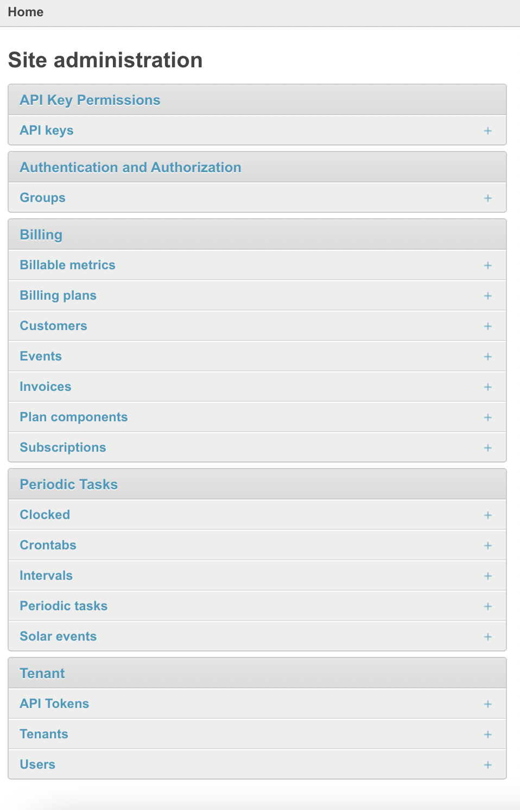

<!-- Improved compatibility of back to top link: See: https://github.com/othneildrew/Best-README-Template/pull/73 -->
<a name="readme-top"></a>
<!--


<!-- PROJECT SHIELDS -->
<!--
*** I'm using markdown "reference style" links for readability.
*** Reference links are enclosed in brackets [ ] instead of parentheses ( ).
*** See the bottom of this document for the declaration of the reference variables
*** for contributors-url, forks-url, etc. This is an optional, concise syntax you may use.
*** https://www.markdownguide.org/basic-syntax/#reference-style-links
-->
<!-- [![Contributors][contributors-shield]][contributors-url]
[![Forks][forks-shield]][forks-url]
[![Stargazers][stars-shield]][stars-url]
[![Issues][issues-shield]][issues-url]
[![MIT License][license-shield]][license-url]
[![LinkedIn][linkedin-shield]][linkedin-url] -->


<!-- PROJECT LOGO -->


# Lotus: Pricing and Billing, Your Way

<br/>

Lotus is an open-core billing and price optimization software. We enable SaaS companies to manage and experiment in real-time with custom subscription and usage based billing.

<br/>

We provide a flexible and modular approach to every step of the billing experience, from metering to invoicing to helping you understand the optimal pricing scheme for your product.

<br/>

[Website]("https://www.uselotus.io/) · [Issues](https://github.com/uselotus/lotus/issues) · [Docs](https://docs.uselotus.io/docs/lotus-docs) · [Contact Us](founders@uselotus.io)

<br/>

## Table of Contents
1. [About the Project](#about-the-project)
2. [Getting Started](#getting-started)
    * [Prerequisites](#prerequisites)
    * [Installation](#installation)
3. [Examples](#usage)
4. [Contributing](#contributing)
5. [License](#license)
6. [Contact](#contact)


<!-- ABOUT THE PROJECT -->
## About The Project

Lotus is the quickest way to start billing flexibly and experiment with pricing. Our founders studied at MIT together and went on to DE Shaw and Citadel before joining forces to allow SaaS companies to price products accurately. Our metering and billing solutions are open source and free for self-hosting. We charge for our cloud version, enterprise support (SSO, advanced permissions), and extra custom features we will add to the code over time.

<p align="right">(<a href="#lotus-pricing-and-billing-your-way">back to top</a>)</p>

<!-- GETTING STARTED -->
## Getting Started

[](https://heroku.com/deploy)


For docker use this method:

To get a local copy up and running follow these simple example steps.

### Prerequisites

Here are the packages you'll need to install before getting set up with your local instance of Lotus:
* docker
  ```sh
  brew install docker
  ```
* docker-compose
  ```sh
  brew install docker-compose
  ```

### Installation

1. Clone the repo
   ```sh
   git clone https://github.com/uselotus/lotus.git
   ```
2. Navigate to the correct directory
   ```sh
   cd lotus
   ```
3. Build the docker container. This can take a few minutes, so be patient.
   ```sh
   docker-compose up --build
   ```
4. Navigate to [local.localhost:8000/admin/](http://local.localhost:8000/admin/). This is an experimental, early-stage UI, from which you can track various different stages of the billing process. Sign in using
5. Navigate to [local.localhost:8000/admin/tenant/apitoken/](http://local.localhost:8000/admin/tenant/apitoken/), click on [add an API token](http://local.localhost:8000/admin/tenant/apitoken/add/), and save the generated API token somewhere safe (you won't see it again!).

From here, you can either interact with Lotus using the UI, or integrate + test our extensive APIs.

### Lotus UI
This is what you'll see in the Django UI's homepage. v0 of Lotus is simply an API so Django's built in frontend works as a substitude for our v1 which will be launching soon:
<br/>

<br/>
The workflow is as follows:
1. Go into the [Customers tab](http://local.localhost:8000/admin/billing/customer/) and create a new customer. Don't worry about the `billing_id`, it's been auto-generated! Just name them, give them a unique id, and decide whether to give them an initial balance on their account.
2. Create a [billing plan](http://local.localhost:8000/admin/billing/billingplan/add/) for your customer. Don't worry about what you're billing them _for_ yet, this simply defines how often you'll be billing them and whether there's a flat fee associated with their plan.
3. Start logging discrete events in the [Events tab](http://local.localhost:8000/admin/billing/event/). This could be something like an API call, an hourly log of storage usage, or anything you can think of. The `properties` is a fully-customizable json for your own use. Track whetever you think is useful that you might want to group, aggregate, or filter by, such as the geography of origin of the request, number of bytes used, or uptime.
    * Note that it's compeltely impractical to log events manually in the UI. To use the system at scale, you definitely want to use the API for this step, but this works for testing purposes.
4. Start creating [billable metrics](http://local.localhost:8000/admin/billing/billablemetric/). Every event can have any amount of billing metrics associated with it, whether that's a simple `count` over the number of events, or a `sum` or `max` over some of the properties you defined in your event type.
5. Now, we have to connect these billable metrics with specific customers. The way we do this is using [plan components](http://local.localhost:8000/admin/billing/plancomponent/), which allow you to match one of these metrics with a customer's billing plan. Here's where you set the price of the billable metric, and have the ability to tier prices by setting a certain amount of free units of this metric.


<p align="right">(<a href="#lotus-pricing-and-billing-your-way">back to top</a>)</p>


<!-- USAGE EXAMPLES -->
## Examples

_For more examples, please refer to the [Documentation](https://uselotus.stoplight.io/)_

<p align="right">(<a href="#lotus-pricing-and-billing-your-way">back to top</a>)</p>


<!-- CONTRIBUTING -->
## Contributing

Contributions are what make the open source community such an amazing place to learn, inspire, and create. Any contributions you make are **greatly appreciated**.

If you have a suggestion that would make this better, please fork the repo and create a pull request. You can also simply [request a feature]().
Don't forget to give the project a star! Thanks again!

<p align="right">(<a href="#lotus-pricing-and-billing-your-way">back to top</a>)</p>


<!-- LICENSE -->
## License

Distributed under the MIT License. See `LICENSE` for more information.

<p align="right">(<a href="#lotus-pricing-and-billing-your-way">back to top</a>)</p>


<!-- CONTACT -->
## Contact

Lotus founders - founders@uselotus.io

Or visit lotus.env

<p align="right">(<a href="#lotus-pricing-and-billing-your-way">back to top</a>)</p>


<!-- MARKDOWN LINKS & IMAGES -->
<!-- https://www.markdownguide.org/basic-syntax/#reference-style-links -->
[contributors-shield]: https://img.shields.io/github/contributors/uselotus/lotus.svg?style=for-the-badge
[contributors-url]: [https://github.com/uselotus/lotus/graphs/contributors]
[forks-shield]: https://img.shields.io/github/forks/github_username/repo_name.svg?style=for-the-badge
[forks-url]: https://github.com/uselotus/lotus/network/members
[stars-shield]: https://img.shields.io/github/stars/uselotus/lotus.svg?style=for-the-badge
[stars-url]: https://github.com/uselotus/lotus/stargazers
[issues-shield]: https://img.shields.io/github/issues/github_username/repo_name.svg?style=for-the-badge
[issues-url]: https://github.com/github_username/repo_name/issues
[license-shield]: https://img.shields.io/github/license/github_username/repo_name.svg?style=for-the-badge
[license-url]: https://github.com/github_username/repo_name/blob/master/LICENSE.txt
[linkedin-shield]: https://img.shields.io/badge/-LinkedIn-black.svg?style=for-the-badge&logo=linkedin&colorB=555
[linkedin-url]: https://linkedin.com/in/uselotusio
[product-screenshot]: images/screenshot.png
[Next.js]: https://img.shields.io/badge/next.js-000000?style=for-the-badge&logo=nextdotjs&logoColor=white
[Next-url]: https://nextjs.org/
[React.js]: https://img.shields.io/badge/React-20232A?style=for-the-badge&logo=react&logoColor=61DAFB
[React-url]: https://reactjs.org/
[Vue.js]: https://img.shields.io/badge/Vue.js-35495E?style=for-the-badge&logo=vuedotjs&logoColor=4FC08D
[Vue-url]: https://vuejs.org/
[Angular.io]: https://img.shields.io/badge/Angular-DD0031?style=for-the-badge&logo=angular&logoColor=white
[Angular-url]: https://angular.io/
[Svelte.dev]: https://img.shields.io/badge/Svelte-4A4A55?style=for-the-badge&logo=svelte&logoColor=FF3E00
[Svelte-url]: https://svelte.dev/
[Laravel.com]: https://img.shields.io/badge/Laravel-FF2D20?style=for-the-badge&logo=laravel&logoColor=white
[Laravel-url]: https://laravel.com
[Bootstrap.com]: https://img.shields.io/badge/Bootstrap-563D7C?style=for-the-badge&logo=bootstrap&logoColor=white
[Bootstrap-url]: https://getbootstrap.com
[JQuery.com]: https://img.shields.io/badge/jQuery-0769AD?style=for-the-badge&logo=jquery&logoColor=white
[JQuery-url]: https://jquery.com
